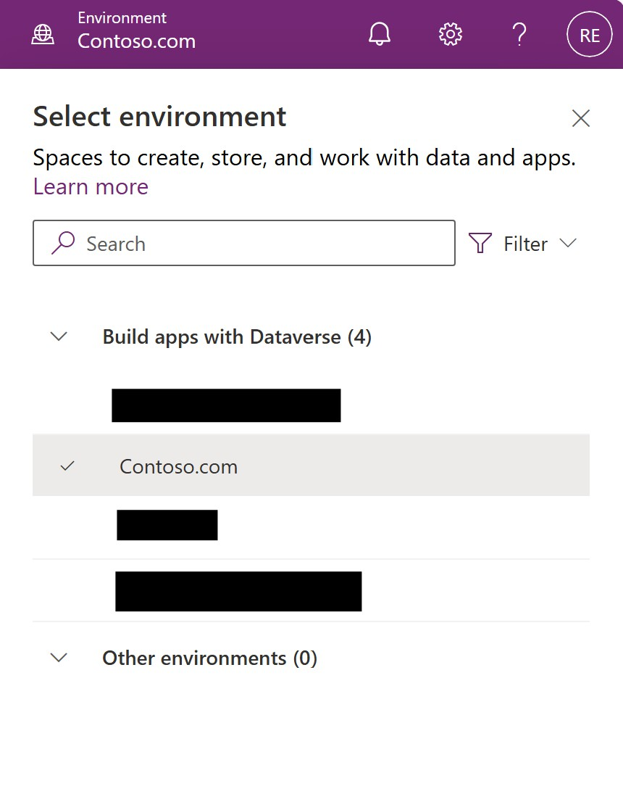
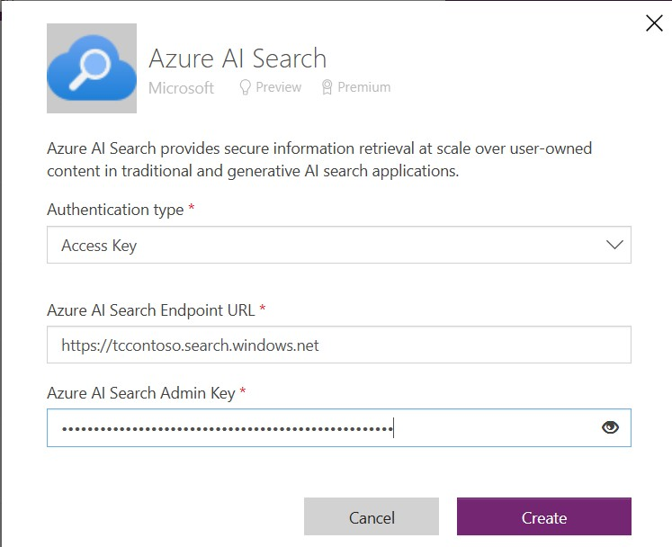

# Power Platform Instructions

## Configure the Power Platform Environment

Go to [Power Platform Admin Center ](https://admin.powerplatform.microsoft.com/) and create a new environment.  You can choose whether or not to create an environment with or without a dataverse database.  

Information on both options are below.  Be sure to select the correct environment for your licensing type.  The environment will take some time to Prepare.   Wait until the state says "ready" before continuing onward to step 2.

- [Create an environment with a database](https://learn.microsoft.com/en-us/power-platform/admin/create-environment#create-an-environment-with-a-database)
- [Create an environment without a Database](https://learn.microsoft.com/en-us/power-platform/admin/create-environment#create-an-environment-with-a-database)

## Configure the Azure AI Search Connector

With the new environment prepared, it is time to create the required data connection to your Azure AI Search index.  go to the [Power Apps portal](https://make.powerapps.com/) and select the appropriate environment from the dropdown at the upper right corner of the browser window. 

Then, go to connectors and scroll down to Azure AI Search.  Click the Plus symbol to add this connector to your environment. 

Configure this connector with the following values. Click save to continue.  You will know if the values and access are connect if the connector says that it is now connected.

- Azure AI Search endpoint (Available in the Azure portal or from the CLI)
- Azure AI Search API Key (Available in the Azure Portal)
- Display name (Enter the value you choose)
- Authentication Type (Access Key is all that is available at time of writing)

After saving, you will see the connector in the list of connectors.  If it says "connected" then you are ready to move on to the next step.  If no, go back and verify that you have entered the right values for the variables in the previous step. 

You have now successfully configured the Azure AI Search connector for use in your Power Platform environment.  Please move on to the next step of [Creating the agent in Copilot Studio](./CopilotStudio.md)